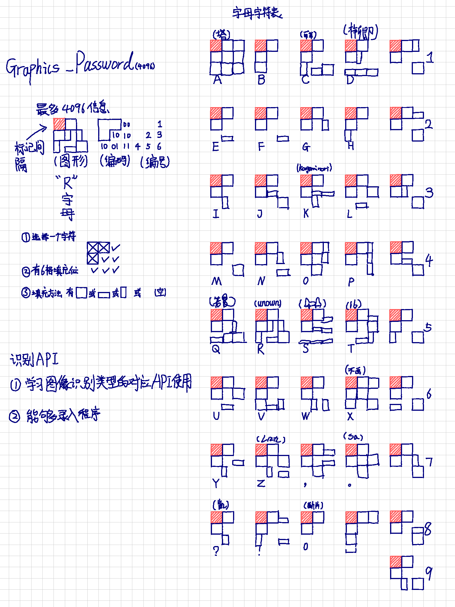
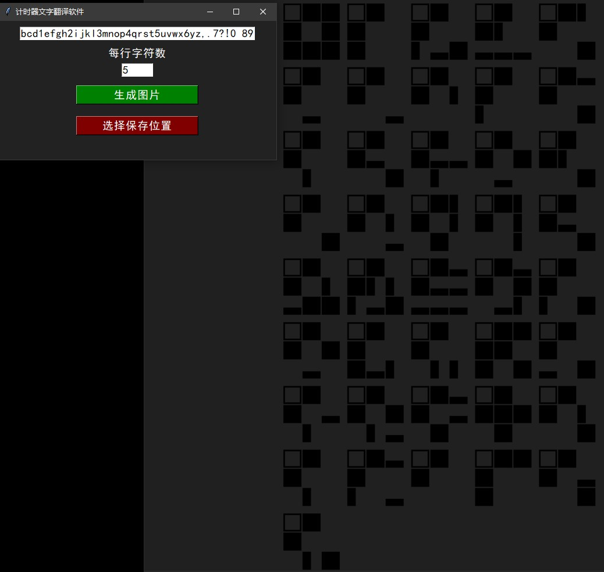
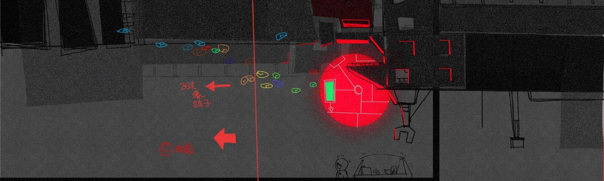
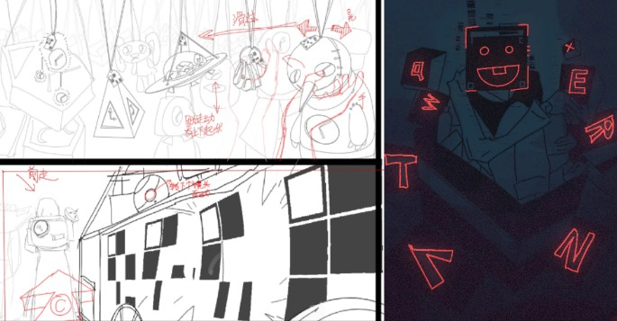
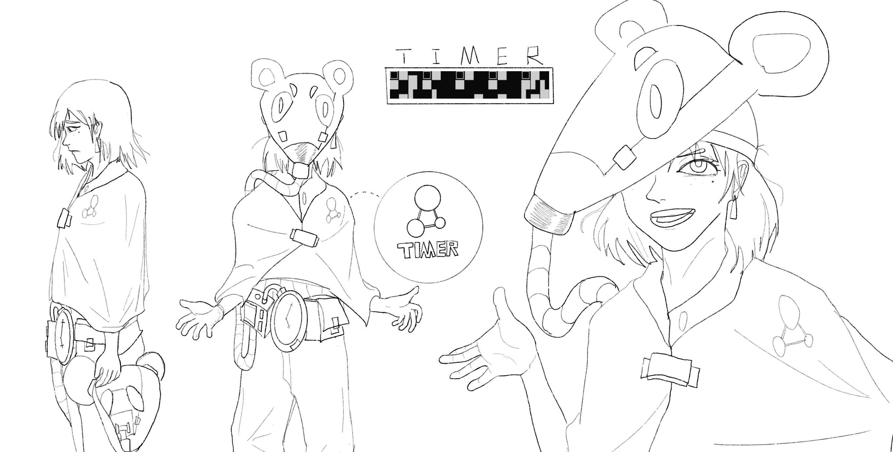

<h1 align="center">
   
  
   
    

  <strong style="font-weight: bold; font-size: 40px;">独立动画 《计时器》配套小程序</strong>

  <strong style="font-weight: bold; font-size: 40px;">Animation:TIMER's words</strong>

  
   

## How To Use

- 运行run_tiemr.bat
- run run_tiemr.bat

</h1

    你要是没啥事可以下载下来玩玩
    该程序是为下一部独立动画《TIMER》所有其世界中使用的文字的对应自动生成器
    用于辅助动画制作
    2021年9月在火药方糖和摔跤社时找大家设计的，对应名字保留在了注释里（白嫖数字签名）
    This program is an automatic generator for the corresponding text that appears in all scenes of the upcoming independent animation*TIMER* . It is designed to assist in the production of the animation.

<h1 align="center">
   
    
    
   

## 动画早期分镜&废弃

Early Animation Concept (Abandoned) and Storyboard

<h1 align="center">
   
    
    
    
   
  
</h1

* 功能更新
  - [X] 将原本编写的程序C++程序转换成python,完成图形交互提供了windows自动化的bat安装包
  - [ ] 反向将图形识别为对应的字符。（深度学习模型练习项目）
* Feature Updates
  - [X] Converted the originally written C++ program to Python, completed graphical interaction, and provided a Windows automation BAT installer package.
  - [ ] Reverse the graphical recognition to corresponding characters. (Deep learning model practice project)

  <a href="https://space.bilibili.com/14366530?spm_id_from=333.1007.0.0">BiliBili</a>  · 
  <a href="https://github.com/UNKNOWNTIMER">GitHub</a>  · 
  <a href="https://www.youtube.com/@unknowntimer6854">YouTube</a>  · 
  <a href="https://x.com/UNKNOWNTIMER0">X</a>

